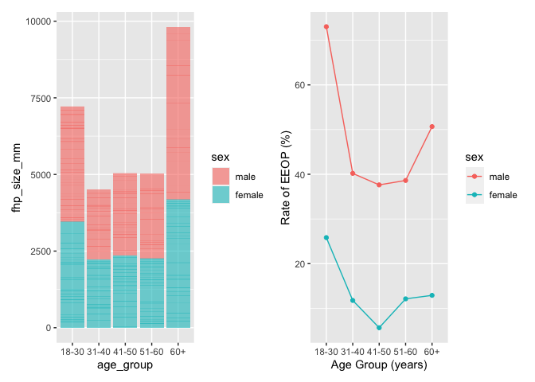

p8105\_mtp\_lh3109
================
Lesi He
2021-10-28

``` r
library(tidyverse)
```

    ## ── Attaching packages ─────────────────────────────────────── tidyverse 1.3.1 ──

    ## ✓ ggplot2 3.3.5     ✓ purrr   0.3.4
    ## ✓ tibble  3.1.4     ✓ dplyr   1.0.7
    ## ✓ tidyr   1.1.3     ✓ stringr 1.4.0
    ## ✓ readr   2.0.1     ✓ forcats 0.5.1

    ## ── Conflicts ────────────────────────────────────────── tidyverse_conflicts() ──
    ## x dplyr::filter() masks stats::filter()
    ## x dplyr::lag()    masks stats::lag()

``` r
library(dplyr)
library(readxl)
```

## Problem 1

Data Cleaning

``` r
data_df =
  #import data
  read_excel("data/p8105_mtp_data.xlsx", range = "A9:I1230") %>% 
  #clean variable names
  janitor::clean_names() %>% 
  mutate(
    #replace missing value in eop_size_mm with 0
    eop_size_mm = ifelse(is.na(eop_size_mm), 0, eop_size_mm),
    #factor "sex" column
    sex = factor(sex, levels = c("1","0"), labels = c("male", "female")),
    #factor age group
    age_group = factor(age_group, levels = c("2","3","4","5","6","7","8"),
                       labels = c("18-30 age", "31-40 age", "41-50 age", 
                                  "51-60 age", "6", "7", "8")),
    #combine 6,7,8 factors levels in age group
    age_group = fct_collapse(age_group, "60+ age" = c("6","7","8")),
    #factor EOP size
    eop_size = factor(eop_size, levels = c("0","1","2","3","4","5")),
    #factor FHP category
    fhp_category = factor(fhp_category, levels = c("0","1","2","3","4"))
    )
```

## Problem 2 Visualization

Association between FHP size and EOP size in each age and sex group

``` r
data_df %>% 
  #remove the variable with labeled "1" in age group
  drop_na(age_group) %>% 
  #remove missing values in eop size
  filter(!eop_size_mm == 0) %>% 
  #plot graph for association of eop size and fhp size
  ggplot(aes(x = fhp_size_mm, y = eop_size_mm)) +
  #line graph
  geom_line(color = "steelblue") + 
  #plot graph
  geom_point(alpha = 0.5, color = "steelblue") +
  #create muti-panel by sex and age_group variable
  facet_grid(sex ~ age_group) +
  #modify labels
  xlab("FHP Size (mm)") + 
  ylab("EOP Size (mm)") +
  ggtitle("Assocation between FHP Size and EOP Size in different Sex and Age Groups")
```

<!-- -->
