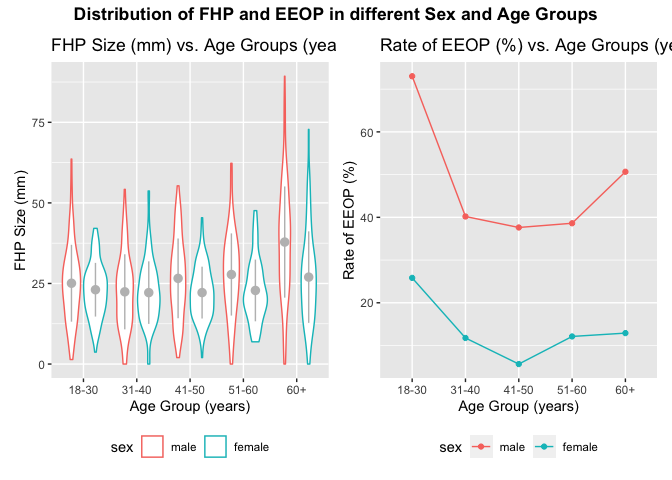

p8105\_mtp\_lh3109
================
Lesi He
2021-10-28

``` r
#import library
library(tidyverse)
library(dplyr)
library(readxl)
library(patchwork)
```

## Introduction

Investigating the degree of forward head protraction (FHP) and the
enlarged external occipital protuberance (EEOP) among different sex and
age groups, this project aims to improve the data analysis and plots
presented in the original paper.

## Problem 1

After importing the data, the variable names are formatted for better
reading. The EOP Size(mm) is corrected based on the comments in the
excel file: filling empty cells with 0 (represent missing value).
According to the notes, some useful variable including Sex, Age group,
and EOP size are factored into different levels. There are 1221
participants in total. The age and gender distribution are shown in the
table below:

``` r
data_df =
  #import data
  read_excel("data/p8105_mtp_data.xlsx", range = "A9:I1230") %>% 
  #clean variable names
  janitor::clean_names() %>% 
  mutate(
    #replace missing value in eop_size_mm with 0
    eop_size_mm = ifelse(is.na(eop_size_mm), 0, eop_size_mm),
    #factor "sex" column
    sex = factor(sex, levels = c("1","0"), labels = c("male", "female")),
    #factor age group
    age_group = factor(age_group, levels = c("2","3","4","5","6","7","8"),
                       labels = c("18-30", "31-40", "41-50", 
                                  "51-60", "6", "7", "8")),
    #combine 6,7,8 factors levels in age group
    age_group = fct_collapse(age_group, "60+" = c("6","7","8")),
    #factor EOP size
    eop_size = factor(eop_size, levels = c("0","1","2","3","4","5")))

data_df %>% 
  select(sex, age_group) %>% 
  group_by(age_group) %>% 
  #drop_na(age_group) %>% 
  count(sex) %>% 
  pivot_wider(
    names_from = sex,
    values_from = n
  ) %>% 
  knitr::kable()
```

| age\_group | male | female |
|:-----------|-----:|-------:|
| 18-30      |  152 |    151 |
| 31-40      |  102 |    102 |
| 41-50      |  101 |    106 |
| 51-60      |  101 |     99 |
| 60+        |  150 |    155 |
| NA         |    1 |      1 |

Some issues were found when cleaning the data. First, as shown in the
table above, the row named “NA” suggests that some participants do not
belong to any age groups category factored above. These two data points
are excluded in the following sections. Second, EOP Shape variable in
the file contains many empty values, while the author doesn’t mention
why the cells are empty. Third, the FHP category contains an extremely
large label value: 30.8, while it should be 3 based on the FHP size in
mm and the notes.

## Problem 2 Visualization

``` r
#remove the variable with labeled "1" in age group
#did not correct it in part 1
data_df  = data_df %>%  drop_na(age_group)

#figure 3 improved
fhp_plot = 
  data_df %>% 
  #select the data that will be used in graphing
  select(sex, age_group, fhp_size_mm) %>%
  #group data by sex and age group
  group_by(sex, age_group) %>% 
  #create plot for the data
  ggplot(aes(y = fhp_size_mm, x = age_group, color = sex)) + 
  #create plot to show distribution
  geom_violin() +
  stat_summary(fun.data = mean_sdl, fun.args = list(mult = 1), 
               geom = "pointrange", color = "gray", aes(group = sex), 
               position =  position_dodge(width = 0.9)) +
  #edit x, y axis labels
  ylab("FHP Size (mm)") + 
  xlab("Age Group (years)") +
  #add title
  ggtitle("FHP Size (mm) vs. Age Groups (years)") +
  #move the legend to the bottom
  theme(legend.position = 'bottom') 
  
  
#figure 4 improved  
eeop_plot = 
  data_df %>% 
    #group the data frame by three variables respectively
    group_by(age_group, eop_size, sex) %>% 
    #count the number of eop_size in each group
    count(eop_size) %>% 
    #group the new dataframe by age group and sex
    group_by(age_group, sex) %>% 
    #calculate the rate of each group's EOP
    mutate(rate = n / sum(n) * 100) %>% 
    #calculate the rate of each group's EEOP
    #using 100-rate[1]-rate[2] since rate[5] for some group are missing
    summarise(across(rate), rate = 100 - rate[1] - rate[2]) %>%
    #remove duplicate rate by rows
    distinct(rate) %>% 
    #plot the data
    ggplot(aes(x = age_group, y = rate, color = sex, group = sex)) +
    #create line plot with dots
    geom_point() + geom_line() +
    # add x, y axis labels
    ylab("Rate of EEOP (%)") + xlab("Age Group (years)") +
    #add title to the plot
    ggtitle("Rate of EEOP (%) vs. Age Groups (years)") +
    #move the legend to the bottom
    theme(legend.position = 'bottom')

#combine the two plots in to one
fhp_plot + eeop_plot +
  #add title
  plot_annotation(title = 
                "Distribution of FHP and EEOP in different Sex and Age Groups",
                #put the title at center
                theme = theme(plot.title = 
                                element_text(hjust = 0.5, face = "bold")))
```

<!-- -->

Association between FHP size and EOP size in each age and sex group

``` r
data_df %>% 
  #remove missing values in eop size
  filter(!eop_size_mm == 0) %>% 
  #plot graph for association of eop size and fhp size
  ggplot(aes(x = fhp_size_mm, y = eop_size_mm)) +
  #plot point graph
  geom_point(alpha = 0.5, color = "steelblue") +
  #create muti-panel by sex and age_group variable
  facet_grid(sex ~ age_group) +
  #modify labels
  xlab("FHP Size (mm)") + 
  ylab("EOP Size (mm)") +
  ggtitle("Assocation between FHP Size and EOP Size in different Sex and Age Groups")
```

<!-- -->

The improved Figure 3 is a violin plot with mean and standard deviation
(SD), which better shows the distribution of the FHP size in mm in
different sex and age groups. The line plot next to it is the improved
Figure 4 plot, which replaces the number of EEOP with the rate of EEOP
in each group. Normalizing the number of EEOP brings these data values
to a common scale, making the plot more informative and reliable. A
2x5-panel plot is shown below to better display the causal association
between EEOP and FHP in different sex and age groups.

## Problem 3

The authors’ stated sample size in each age group are not consistent
with the available data. For instance, in 60+ age group, there are 305
participants instead of 300. Additionally, the mean and SD for FHP size
are consistent with the data, which can be seem in the table below.

``` r
data_df %>% 
  group_by(sex) %>% 
  summarise(mean = mean(fhp_size_mm, na.rm = TRUE), 
            sd = sd(fhp_size_mm, na.rm = TRUE))  %>% 
  knitr::kable()
```

| sex    |     mean |       sd |
|:-------|---------:|---------:|
| male   | 28.48993 | 14.66856 |
| female | 23.71455 | 10.62294 |

``` r
data_df %>% 
  group_by(age_group) %>% 
  count(fhp_category) %>% 
  pivot_wider(
    names_from = fhp_category,
    values_from = n
  )
```

    ## # A tibble: 5 × 10
    ## # Groups:   age_group [5]
    ##   age_group   `0`   `1`   `2`   `3`   `4`   `5` `30.8`   `6`   `7`
    ##   <fct>     <int> <int> <int> <int> <int> <int>  <int> <int> <int>
    ## 1 18-30        24    86   120    53    19     1     NA    NA    NA
    ## 2 31-40        19    68    80    25    11     1     NA    NA    NA
    ## 3 41-50        14    61    72    42    16     2     NA    NA    NA
    ## 4 51-60        19    52    64    42    19     2      1     1    NA
    ## 5 60+          24    52    72    58    63    24     NA     7     5

EEOP is the enlarged external occipital protuberance, which is EOP with
10 mm or larger. The finding “the prevalence of EEOP to be 33%” can be
studied using the variable EOP size. This finding is not consistent with
the data as the calculated prevalence is 30.8%. Also, the data is not
consistent with statement “FHP &gt; 40 mm observed frequency (34.5%) in
the over 60s cases” as the actual frequency is 32.3%. However, it is
consistent with the broad trend that FHP is more common in older
subjects.

## Problem 4

In conclusion, though the general trend mentioned by the author in the
paper is consistent with the data, the calculated values are slightly
different from the actual value, indicating the quality of data analysis
is imperfect. The data doesn’t provide sufficient evidence that
smartphones are causing horn growth. To address this hypothesis, more
variables like daily smartphone usage and position when using smartphone
are needed.
